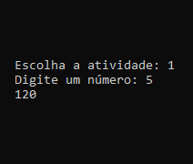
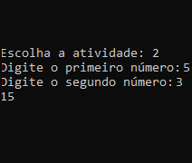
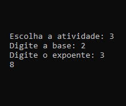
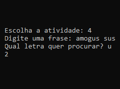
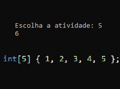

Ao executar o programa deve ser digitada uma opção de 1 a 6, que são referentes as atividades propostas

### 1 - Escreva um método recursivo que retorne o fatorial de um número.

### 2 - Uma multiplicação pode ser vista como uma sequência de somas. Escreva um método recursivo que realize a multiplicação de dois números inteiros, A e B, recebidos por parâmetro.

### 3 - Escreva um método recursivo que realize a potenciação entre dois números inteiros, A e B, recebidos por parâmetro. Seu método deve, portanto, retornar o resultado de AB

### 4 - Escreva um método recursivo que receba uma frase e uma letra como parâmetros. Este método deve retornar a quantidade de ocorrências desta letra nesta frase.

### 5 - Escreva um método recursivo que calcule a soma dos elementos de valor par de um vetor de números inteiros positivos.

### 6 - Escreva um método recursivo que receba uma frase e retorne a mesma frase, sem nenhuma vogal.
