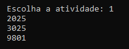

# Documentação da aula de laboratório

* Para cada aula de laboratório, salvar print da execução de cada atividade com o resultado da execução do programa.

### 1 - Separando um número em dois grupos de dois algarismos onde a soma e o quadrado do resultado tem que ser igual ao numero original. Faça um programa que mostre os números de 1000 a 9999 que possuem essa característica

