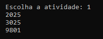
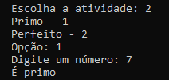
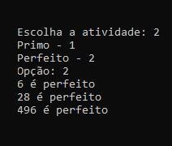
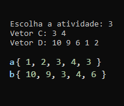
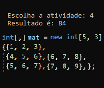
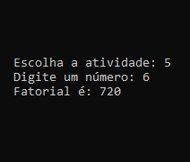
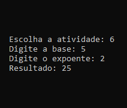

Ao executar o programa deve ser digitada uma opção de 1 a 6, que são referentes as atividades propostas

### 1 - Separando um número em dois grupos de dois algarismos onde a soma e o quadrado do resultado tem que ser igual ao numero original. Faça um programa que mostre os números de 1000 a 9999 que possuem essa característica

### 2 Primo - Um Número é dito Primo se possui como divisores o número 1 e ele mesmo. Em outras palavras, um Número Primo possui dois divisores de 1 até ele. Faça um programa que mostre se um determinado número inteiro, lido pelo teclado, é Primo. 

### Um Número é dito Perfeito se a soma de seus divisores menores que ele é igual a ele. Faça um programa que liste os números perfeitos de 1 a 1000.

### 3 - Faça um programa que receba os elementos de dois vetores, A e B, cada um com 5 posições. Considere que nenhum dos vetores possui elementos repetidos.
* Crie um vetor resultante C que possua os elementos comuns entre A e B.
* Crie um vetor resultante D que contenha os elementos de A que não existam em B.

### 4 - Faça um programa que receba os elementos de uma matriz de 5 linhas por 3 colunas. Mostre a soma dos elementos de cada uma das linhas e das colunas da matriz.

### 5 - Faça um programa que chame uma função capaz de calcular o Fatorial de um número inteiro.

### 6 - Faça um programa que chame uma função capaz de calcular 𝑥^𝑦 , sendo 𝑥 e 𝑦 inteiros. Utilize passagem de parâmetros por referência. 

