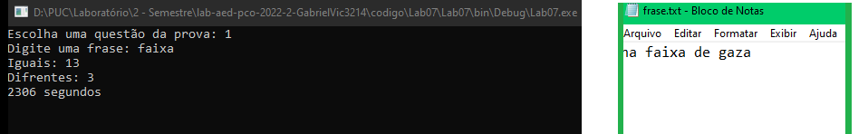
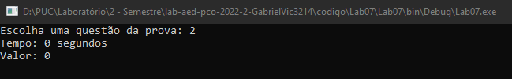
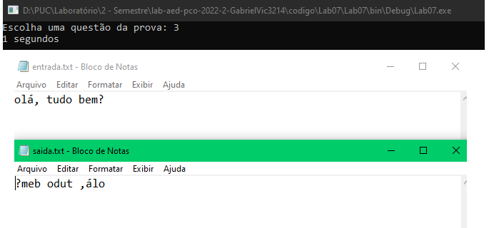
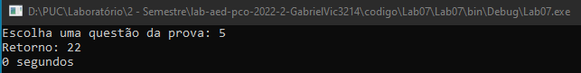

# Ao executar o programa deve ser digitada uma opção de 1 a 6, que são referentes as atividades propostas

### 1 - Um programa que le um arquivo e faz um calculo que mostra quantos termos iguais e diferentes existem

### 2 - Função recursiva funfRec1(6)

### 3 - Ler um arquivo de entrada e escrever ele inverso em um arquivo de saída

### 4 - Escreva um método recursivo que receba uma frase e uma letra como parâmetros. Este método deve retornar a quantidade de ocorrências desta letra nesta frase.

### 5 - Função recursiva funcao(int a, int v[7])

